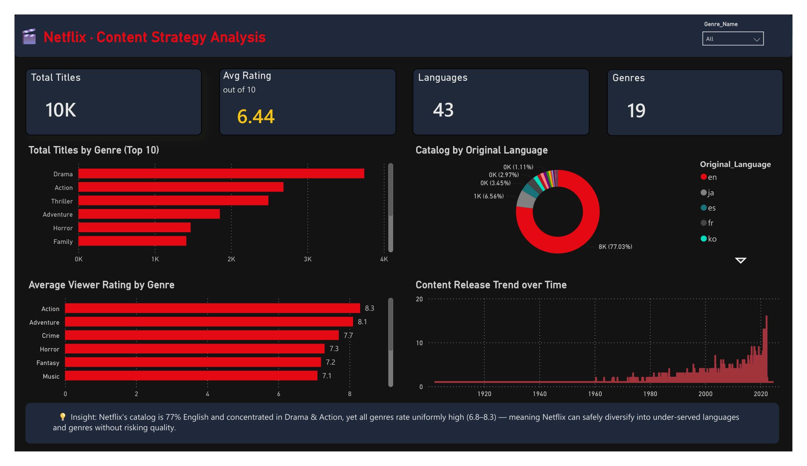

# Netflix · Content Strategy Dashboard (Power BI)

A self-directed **Power BI case study** analyzing a **10,000+ title** movie catalog by genre, language, and viewer rating to inform a content-investment strategy.

## The question
> What does the catalog look like by genre, language, and quality — and where can Netflix grow?

## Key findings
- The catalog is **77% English** and heavily concentrated in **Drama & Action**.
- Yet **every genre rates uniformly high (6.8–8.3 / 10)** — quality is consistent across the board.
- **Recommendation:** Netflix can **safely diversify into under-served languages and genres** without risking quality.

## Data modeling (star schema)
The raw movie dataset was normalized into a **star schema** with `main.py` (pandas):
- `dim_movies` — one row per movie (title, rating, language, popularity…)
- `dim_genres` — the genre dimension
- `Fact_movie_genres` — the movie ↔ genre bridge (fact) table

## Engineering highlight 🐛→✅
The first build **over-counted**: counting `Movie_ID` across the genre fact table meant a movie with 3 genres was counted **3×** (English showed 20K out of a 10K catalog — impossible). Fixed by switching to a **`DISTINCTCOUNT(dim_movies[Movie_ID])`** measure so every movie counts once. A good lesson in **data integrity** and reading numbers critically.

## Built with
- **Power BI Desktop** — KPI cards, slicer, executive layout, insight summary
- **DAX** — `DISTINCTCOUNT`, `AVERAGE`, measures formatted as %
- **Python (pandas)** — star-schema ETL (`main.py`)

## Files
| File | What it is |
|---|---|
| `netflix_dashboard.png` / `Netflix_Dashboard Copy.pdf` | The finished dashboard |
| `main.py` | pandas ETL that builds the star schema |
| `dim_movies.csv`, `dim_genres.csv`, `Fact_movie_genres.csv` | The modeled tables |
| `mymoviedb.csv` | The raw source dataset |

## Data source
Public TMDB-style movie dataset (`mymoviedb.csv`).
